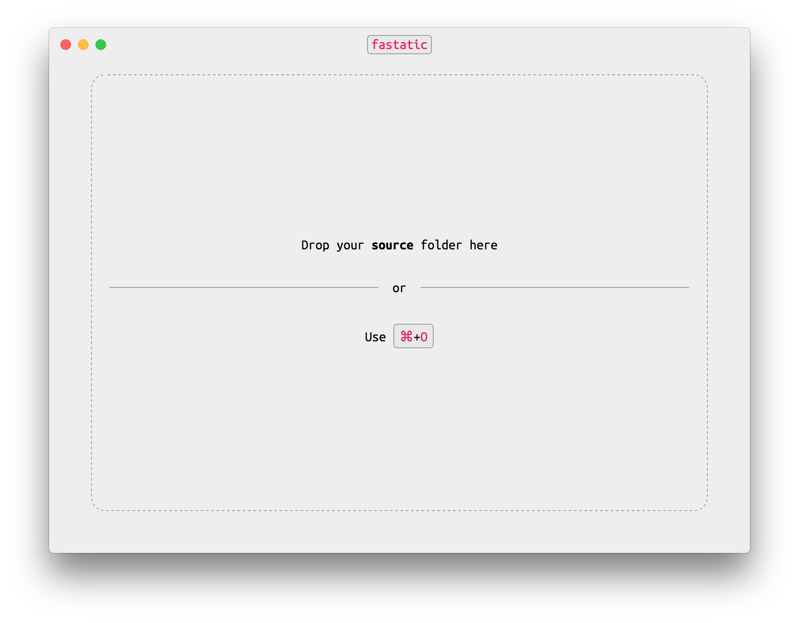
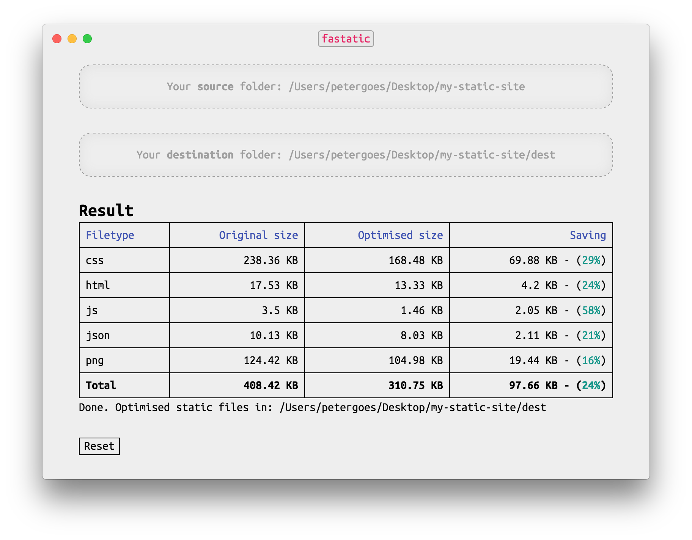

# Fastatic App

**Warning:** This app is still in Beta. As such, we currently only have a build 
for macOS.

### Download

You can find Fastatic App in the [releases](fastatic-app/releases) section. 
Under "Latest release", download `Fastatic.App-darwin-x64.zip`.

## Introduction
Fastatic App shrinks your static site footprint. Making it even faster to 
download. Use it as a standalone app, or plug it directly in your build process 
via its engine [`fastatic`](https://github.com/voorhoede/fastatic). Jump to 
[How does it work?](#how-does-it-work) to find out how to use Fastatic App.

## Speed up your static site

A speedy website is important. Having a static site is a very good first step.
Using a static site generator can be very convenient. However, often times they 
do not optimise your site right out of the box. Fastatic App solves that by 
being a one stop solution. Drag your static site in Fastatic and it optimises it 
for you.

## How does it work?

When you open the app, you can drag the folder with your static site files into 
app window. Next you can choose a destination folder for your optimised files.
If you do not have a destination folder, you can create one or choose from the 
options presented by the app.

When `fastatic` is done optimising your files, you'll see a report showing you
how much your files have shrunk in size and where to find your optimised files.

Now upload your optimised files to your website, and your done!

## What does it do?

Minification. Your HTML, CSS and JS files will be minified. Image files are 
optimised. More features are on their way, but for now everything is minified.

## Contribute

This project builds on a version of 
[`fastatic`](https://github.com/voorhoede/fastatic) which is currently in 
development. As such, the `fastatic` module is not in the `package.js`. 

Once the `fastatic` module is released with the features this projects needs, 
the `package.json` is updated, and you don't have to jump through hoops any 
more.

For now, clone the [`fastatic`](https://github.com/voorhoede/fastatic) project 
and get it to work. Then, inside the project root execute `$ npm link`. This 
will 'install' `fastatic` in your global `.npm` directory. Next go to the root 
of this project (`fastatic-app`) and execute `$ npm link fastatic`.

## License

[MIT licensed](LICENSE) © [De Voorhoede](https://www.voorhoede.nl/)
